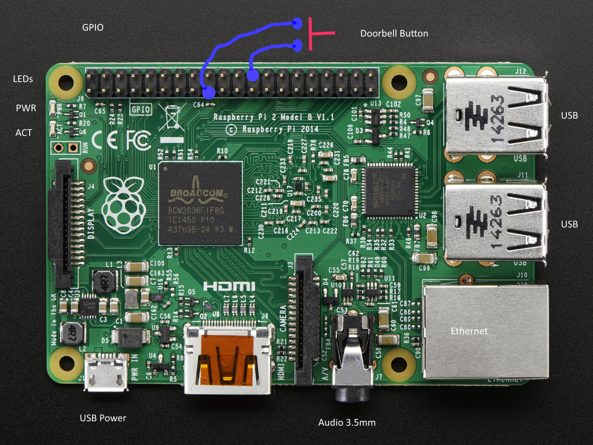
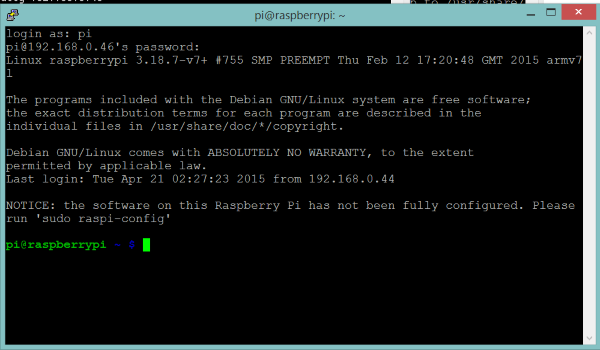

### Getting Started

NOTE: All commands in linux are case sensitive so make sure you pay attention to the instructions below.

1. Make sure you know what **door number** your Raspberry Pi will be for the Lab.  Each participant should have a unique door number that they will use throughout the lab.
2. The Raspberry PI 2 has the following layout:
	
	

3. Wire up the push button switch to the Raspberry Pi as shown in the above picture
4. Plug in your Speakers or Headphones into he Raspberry PI's Audio 3.5mm jack
5. Plug in the Ethernet cable into the PI's Ethernet connector
6. Plug in the USB power cable into your Laptop or another USB Power device such as a phone charger 
7. Plug in the Micro USB end of the power cable to the PI's USB Connector
8. The Raspberry PI should begin to power up.  You should see the PWR and ACT LEDs begin to flash
9. Listen for the IP Address to be announced through the speakers and make a note of it.
10. Run Putty (or other telnet program) on your laptop and use the Pi's IP address to connect to it.
	1. You can run putty from a command prompt and pass it the IP to connect
	2. Example: **putty 192.168.0.46**
11. At the **logon as:** prompt enter **pi**
12. At the **password** prompt enter **raspberry**
13. You should be at the linux shell prompt after the credentials have been entered correctly

	

14. Execute the following git command to clone the repository for the lab
...    
git clone https://github.com/CharlotteIoT/Lab001-pi.git
...

[Previous](README.md) [Next](Step1.md)

 

